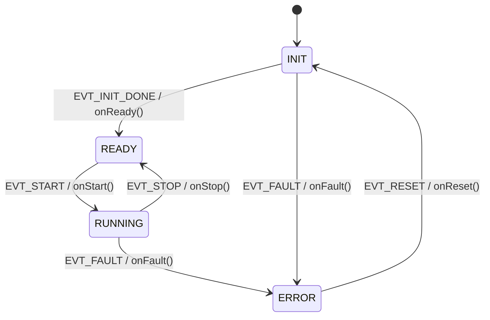

# c-embedded-fundamentals


A portable C library of embedded systems primitives — written without dynamic memory allocation, external dependencies, or hardware requirements. Every module targets the constraints and idioms of real production firmware.

> This repository is not a tutorial. It is a demonstration of how embedded C is written when correctness, safety, and portability matter.

---

## Why This Exists

In embedded systems, the standard library is often unavailable or unsafe to use. There is no heap. There is no OS. Resources are shared between interrupts and application code with no protection. Every byte and every cycle counts.

This library implements the building blocks that live at the foundation of any embedded application — the patterns you find inside FreeRTOS, automotive ECUs, and industrial controllers — written from scratch to demonstrate understanding from first principles.

---

## Modules

### 1. `bit_utils` — Bit Manipulation and Register Abstraction

Utilities for manipulating individual bits and bitfields. The foundation of any hardware abstraction layer — how embedded code talks to registers without magic numbers.

**Demonstrates:**
- Set, clear, toggle, and test operations using bitwise masking — no `if/else`, no loops
- Single-line implementations that any embedded engineer recognizes immediately
- Why `uint32_t *reg` instead of `uint32_t reg` — modifying hardware in place via pointer
- `volatile` rationale for memory-mapped register access

**API:**
```c
void    BIT_set    (uint32_t *reg, uint8_t pos);  /* reg |= (1 << pos)        */
void    BIT_clear  (uint32_t *reg, uint8_t pos);  /* reg &= ~(1 << pos)       */
void    BIT_toggle (uint32_t *reg, uint8_t pos);  /* reg ^= (1 << pos)        */
uint8_t BIT_test   (uint32_t *reg, uint8_t pos);  /* (reg & (1<<pos)) >> pos  */
uint32_t BIT_extract(uint32_t val, uint8_t pos, uint8_t width);
uint32_t BIT_insert (uint32_t val, uint32_t field, uint8_t pos, uint8_t width);
```

**Simulated UART config register using `union` + bitfield `struct`:**
```c
typedef union {
    uint32_t raw;
    struct {
        uint32_t baud_sel   : 3;  /* 000=9600, 001=19200, 010=115200 */
        uint32_t parity_en  : 1;
        uint32_t parity_sel : 1;  /* 0=even, 1=odd                   */
        uint32_t stop_bits  : 1;  /* 0=1bit, 1=2bits                 */
        uint32_t reserved   : 26;
    } bits;
} UART_Config_t;
```

---

### 2. `ring_buffer` — Static Circular Buffer

A generic FIFO buffer with compile-time-fixed capacity. No `malloc`. Designed for UART receive buffers, sensor queues, and any producer-consumer scenario in firmware.

**Demonstrates:**
- Static memory allocation — buffer size fixed at compile time via `#define`
- Head/tail index model — no data movement, only index advancement
- Count field to resolve the full/empty ambiguity (`head == tail` is ambiguous without it)
- Pointer arithmetic and index wrapping

**Structure:**
```c
#define RING_BUFFER_SIZE 8

typedef struct {
    uint8_t  buffer[RING_BUFFER_SIZE];
    uint16_t head;   /* next write position */
    uint16_t tail;   /* next read position  */
    uint16_t count;  /* current occupancy   */
} RingBuffer_t;
```

**API:**
```c
void     RingBuffer_init   (RingBuffer_t *rb);
bool     RingBuffer_push   (RingBuffer_t *rb, uint8_t byte);
bool     RingBuffer_pop    (RingBuffer_t *rb, uint8_t *byte);
bool     RingBuffer_peek   (RingBuffer_t *rb, uint8_t *byte);
bool     RingBuffer_isEmpty(RingBuffer_t *rb);
bool     RingBuffer_isFull (RingBuffer_t *rb);
uint16_t RingBuffer_count  (RingBuffer_t *rb);
```

---

### 3. `fixed_point` — Q16.16 Fixed-Point Arithmetic

Arithmetic library for systems without a floating-point unit (FPU), using Q16.16 format.

**Demonstrates:**
- Why `float` is problematic on MCUs without FPU (cycles, determinism, MISRA)
- Representation of fractional values using integers
- Overflow detection in multiplication via 64-bit intermediate
- Practical use case: wheel speed from RPM and radius — no `float`

**Format:**
```
Q16.16 stored as int32_t
  Bits 31..16 : integer part
  Bits 15..0  : fractional part (resolution: 1/65536)

  Example: 3.14159 → (int32_t)(3.14159 * 65536) = 205887
```

---

### 4. `state_machine` — Table-Driven Finite State Machine

A generic FSM engine driven by a transition table. States and events are enums. Actions are function pointers. The engine has no knowledge of application logic.

**Demonstrates:**
- Function pointers as first-class citizens in C
- Separation of mechanism (engine) from policy (table)
- Why this pattern scales — adding a state means adding a row, not editing engine code

**Concrete example — ECU lifecycle:**



---

### 5. `watchdog` — Software Watchdog Timer

A software watchdog that fires a configurable callback if not kicked within a given number of ticks. Integrates with the FSM to force an `ERROR` state on timeout.

**Demonstrates:**
- Safety-critical design: fail-safe over fail-silent
- Callback pattern via function pointer — configurable at init, not hardcoded
- Hardware-agnostic tick model — caller drives ticks, module stays portable

---

## Integration Example

`examples/ecu_lifecycle.c` wires all five modules together:

- A `RingBuffer` holds incoming diagnostic bytes from a simulated UART
- `BIT_extract` parses a status register value from the buffer
- The parsed status triggers FSM events
- The `Watchdog` monitors that events arrive within the expected window
- On timeout: watchdog fires → FSM transitions to `ERROR`

This mirrors the architecture of a real ECU diagnostic handler.

---

## Project Structure

```
c-embedded-fundamentals/
├── README.md
├── include/
│   ├── bit_utils.h
│   ├── ring_buffer.h
│   ├── fixed_point.h
│   ├── state_machine.h
│   └── watchdog.h
├── src/
│   ├── bit_utils.c
│   ├── ring_buffer.c
│   ├── fixed_point.c
│   ├── state_machine.c
│   └── watchdog.c
├── tests/
│   ├── test_bit_utils.c
│   ├── test_ring_buffer.c
│   ├── test_fixed_point.c
│   ├── test_state_machine.c
│   └── test_watchdog.c
└── examples/
    └── ecu_lifecycle.c
```

---

## Build and Test

Requires only `gcc`. No external libraries.

```bash
# Compile and run bit_utils tests
gcc -std=c99 -Wall -Wextra -Werror src/bit_utils.c tests/test_bit_utils.c -I include -o test_bit_utils
./test_bit_utils

# Compile and run ring_buffer tests
gcc -std=c99 -Wall -Wextra -Werror src/ring_buffer.c tests/test_ring_buffer.c -I include -o test_ring_buffer
./test_ring_buffer
```

Compiled with `-std=c99 -Wall -Wextra -Werror`. Zero warnings. Zero errors.

---

## Design Decisions

**No `malloc` or `free`**
Dynamic allocation introduces fragmentation, non-deterministic timing, and failure modes that are difficult to detect at runtime. Every buffer in this library has a size known at compile time.

**`uint8_t`, `uint16_t`, `uint32_t` — never bare `int`**
Bare `int` has implementation-defined size — 16 bits on AVR, 32 bits on ARM. Fixed-width types from `<stdint.h>` make memory layout explicit and portable.

**`volatile` where required, nowhere else**
`volatile` prevents the compiler from optimizing away reads/writes to variables that change outside normal control flow (ISRs, hardware registers). Overusing it hurts performance; underusing it causes bugs that only appear in optimized builds.

**Function pointers over switch statements for FSM actions**
A switch-based FSM requires editing the engine for every new state-event pair. A table-driven FSM adds a row to a data structure — the engine never changes. This is the pattern used in production RTOS and automotive middleware.

**Hardware-agnostic tick model for watchdog**
The watchdog does not call any timer API. The caller drives ticks via `WD_tick()`. This makes the module testable on any PC and portable to any MCU without modification.

---

## Learning Reference

Built following the [Modern Embedded Systems Programming](https://www.state-machine.com/video-course) course by Dr. Miro Samek (Quantum Leaps).

| Lesson | Topic | Module |
|--------|-------|--------|
| #1  | How computers count — binary, hex     | Context              |
| #3  | Variables and Pointers                | All modules          |
| #5  | Preprocessor and `volatile`           | `bit_utils`          |
| #6  | Bitwise operators in C                | `bit_utils`          |
| #7  | Arrays and Pointer Arithmetic         | `ring_buffer`        |
| #8  | Functions and the call stack          | `state_machine`      |
| #9  | Modules and code organization         | Project structure    |
| #10 | Stack overflow and pitfalls           | No `malloc` rationale|
| #11 | `stdint.h` and integer types          | All modules          |
| #12 | Structures in C and CMSIS             | `ring_buffer`, `state_machine` |
| #20 | Race conditions                       | `volatile` rationale |

---

## Author

**Eduardo de la Rosa Flores**
Mechatronics Engineer — Tec de Monterrey / Esslingen University
[LinkedIn](https://www.linkedin.com/in/eduardo-delarosa-flores)
